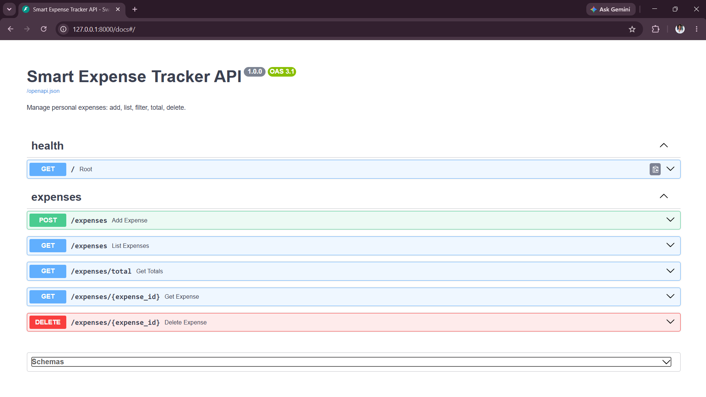
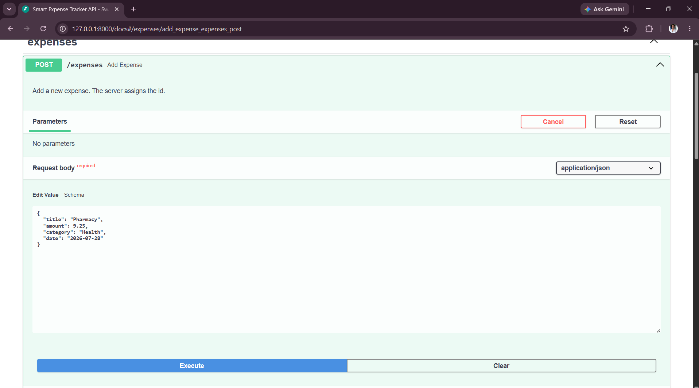
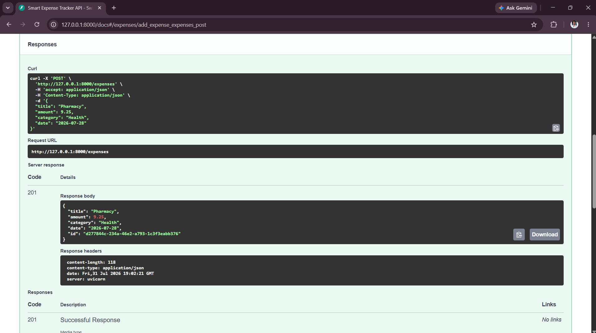
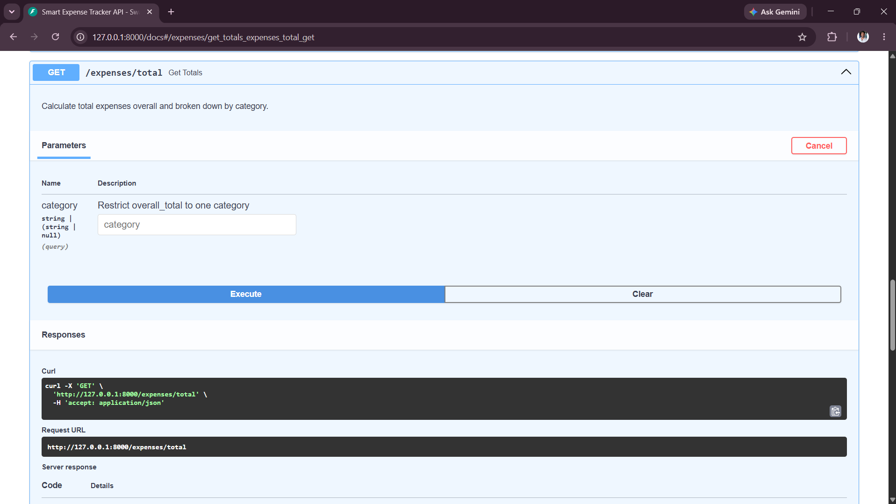
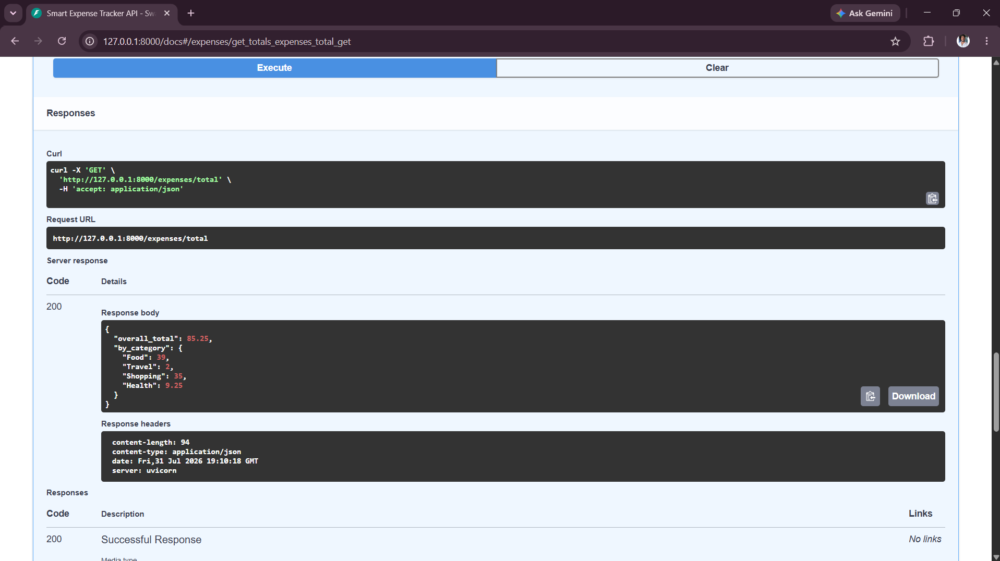

# Smart Expense Tracker API

A REST API for managing personal expenses, built with **FastAPI** (Python).

## Features

- `POST /expenses` — add an expense (title, amount, category, date). The server generates the `id`.
- `GET /expenses` — view all expenses.
- `GET /expenses?category=Food` — filter expenses by category (case-insensitive).
- `GET /expenses/total` — total expenses overall and broken down by category.
- `GET /expenses/{id}` — fetch a single expense by id.
- `DELETE /expenses/{id}` — delete an expense.
- **Bonus implemented:** interactive OpenAPI/Swagger docs, available for free at `/docs` once the server is running (and ReDoc at `/redoc`).

Data is stored in memory and mirrored to a local JSON file (`expenses.json`) so it survives a server restart. No database is required.

## Requirements

- Python 3.10+

## Install dependencies

```bash
python -m venv venv
source venv/bin/activate        # on Windows: venv\Scripts\activate
pip install -r requirements.txt
```

## Run the server

```bash
uvicorn src.main:app --reload
```

The API will be available at `http://127.0.0.1:8000`.
Interactive docs: `http://127.0.0.1:8000/docs`

## Run the tests

```bash
pytest
```

Tests use a separate `test_expenses.json` file (via the `EXPENSES_DATA_FILE` env var) so they never touch your real data, and each test resets state so they can run in any order.

## Project structure

```
your-repo/
  README.md
  AI_NOTES.md
  requirements.txt
  src/
    __init__.py
    main.py       # FastAPI app and route definitions
    models.py      # Pydantic request/response models
    storage.py     # In-memory store + JSON file persistence
  tests/
    test_api.py    # pytest suite covering all endpoints
```

## Example usage

```bash
# Add an expense
curl -X POST http://127.0.0.1:8000/expenses \
  -H "Content-Type: application/json" \
  -d '{"title": "Coffee", "amount": 4.5, "category": "Food", "date": "2026-07-01"}'

# List all expenses
curl http://127.0.0.1:8000/expenses

# Filter by category
curl "http://127.0.0.1:8000/expenses?category=Food"

# Get totals
curl http://127.0.0.1:8000/expenses/total

# Delete an expense
curl -X DELETE http://127.0.0.1:8000/expenses/<id>
```

## Screenshots

**Swagger UI — all endpoints**


**Adding an expense — request**


**Adding an expense — response**


**Totals — request**


**Totals — response**


## Design notes

- Expense `id`s are server-generated UUIDs rather than client-supplied, to guarantee uniqueness without a database.
- Validation (positive amount, non-blank title/category, valid date) is handled by Pydantic and returns `422` with a clear error on bad input.
- Category filtering is case-insensitive since users are unlikely to type categories consistently.
